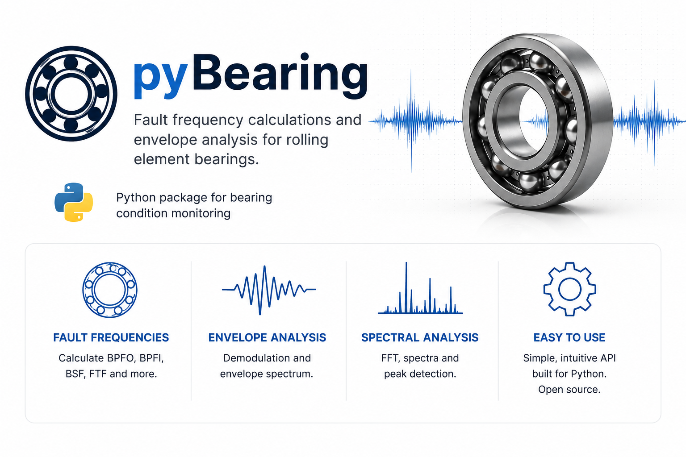

# pyBearing

A lightweight Python package for calculating bearing fault characteristic frequencies and performing envelope analysis for fault detection.

## Features

- Bearing fault characteristic frequencies calculation
- Bearing database
- Envelope extraction and visualization

## Installation

To install the package, run:

```bash
pip install pybearing
```

## Examples

Example notebooks and scripts are available in the `examples/` directory:

- Bearing and FaultFrequencies dataclass showcase
- Use of bearing database
- Showcase of envelope extraction and spectrum on measurement of faulty bearing